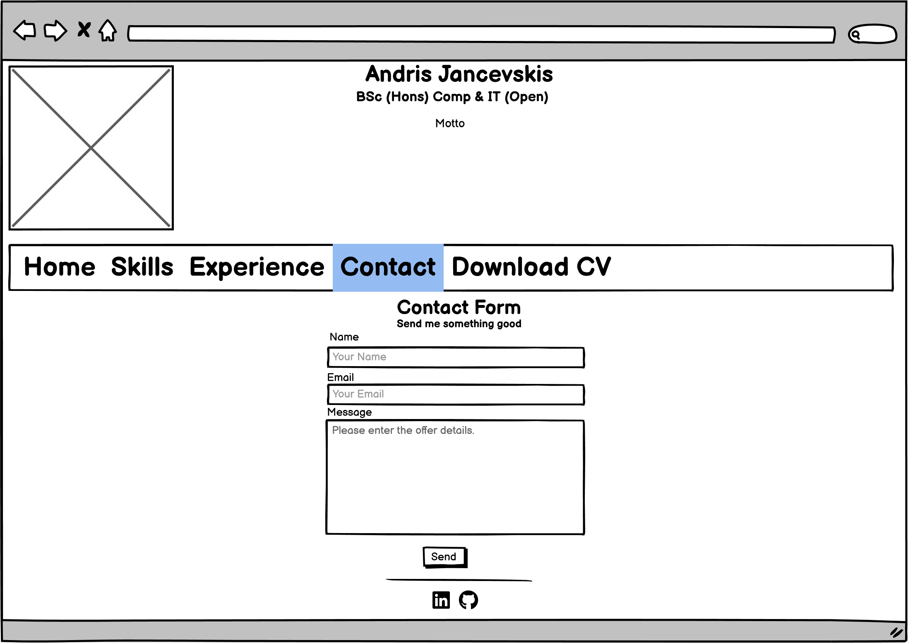

# Andris Jancevskis space
## Introduction
This is a part of me for the public.

## Site's description
This part will be filled AFTER Stage 1 is completed.

## ToDo
> Expand and change ToDo as development progresses. 
> The current Stage is: Development of Stage 1

- [x] Create README.md structure

### Fill the details
- [x] Strategy plane
- [x] Scope plane
- [x] Structure plane
- [X] Skeleton Plane
- [X] Surface Plane

- [ ] Adjust Readme to user Stories (detailed Stage 1 description using user stories)

### Coding
- [ ] Landing page desktop version
- [ ] Landing page desktop other devices
- [ ] Header and Footer for Desktops
- [ ] Header and Footer for other devices
- [ ] Contents for Desktops
- [ ] Contents for other devices

- [ ] replace copyright with social icons in footer

### Testing
- [ ] Testing
- [ ] Validator test screenshots for each page
- [ ] Evidence of user stories being fulfilled

### Other
- [ ] Acknowlegements
- [ ] Site's Desciption

## Development
This part is dedicated to the page's development.
### Strategy plane
#### User requirements
The purpose of the space is to market myself and get hired. The following requirements reflect this purpose.
•	Used technologies should reflect my skills in UI design and development.
•	It contains the list of skills and experience I have acquired. The accent should be on IT skills with complementary business skills.
•	The first page (landing page) should be eye-catching and encourage a visitor to explore further.
•	The site contains links to my Facebook, GitHub and LinkedIn profiles.
•	There is an opportunity to download the whole CV.
•	It must have a Contact page.
•	Pass Code Institute assessment.
Optional:
•	SEO features.
#### Code Institute requirements
Main Technologies
Required: HTML, CSS
Optional: Bootstrap and/or other CSS libraries/frameworks.
Mandatory Requirements
A project violating any of these requirements will FAIL.
1.	Static front-end project: Write custom HTML5 and CSS3 code to create a website of at least 3 pages or (if using a single scrolling page) at least 3 separate page areas.
2.	Information Architecture: Incorporate a main navigation menu and structured layout (you might want to use Bootstrap to accomplish this).
3.	Documentation: Write a README.md file for your project that explains what the project does and the value that it provides to its users.
4.	Version Control: Use Git & GitHub for version control.
5.	Attribution: Maintain clear separation between code written by you and code from external sources (e.g. libraries or tutorials). Attribute any code from external sources to its source via comments above the code and (for larger dependencies) in the README.
6.	Deployment: Deploy the final version of your code to a hosting platform such as GitHub Pages.
#### Audience
The intended audience of the site is potential recruiters and contractors.

### Scope plane
In this initial stage, the design will be created. It will not be publishable for a broader audience in a permanent place.
#### Functional scope
1.	Use HTML5, CSS5 and Bootstrap v5.0.2 (optional).
2.	Static pages only.
3.	A uniform for all page’s mobile version design.
4.	Screen reader’s friendly design.
5.	Use GitHub to save work during development.
#### Content scope
* Landing page with a Wow! design for desktop computers and tablets.
* The contact form with a Thank you page after the message is sent.
* Skills page.
* Work History
* CV download functionality.
#### Out of scope
Here is the listed functionality that is to be implemented to make pages publishable.
* Actual sending email from the contact form. This requires server-side programming.
* ReCAPTCHA in the contact form.
* The content and CV fine-tuning.
* SEO features.
* With server-side interactivity enabled, reorganise the site by moving the header and footer out of each page into separate files and include the header and footer from these files. That will make enabling changes in all site pages easier by changing only one file.
### Structure plane
The structure plane is concerned with design elements – what will be on pages. Wireframes allow seeing what will be on pages. There is no detailed design or colours (in most cases); schematic elements only are placed on a page.

**Landing Page for Desktop computers**

**Landing Page for Mobile devices**

**Skills page**

**Experience page**

**Contact form**

**Contact form feedback**

**Pages for Mobile devices**

### Skeleton Plane

The web page will load seamlessly and pass the Chrome Lighthouse test.

Transitions between screens are not managed, as the next page will load seamlessly having only one image.

The content of pages will be consistent and accurate by meaning.

Users with assisted technologies such as screen readers can access all content.

### Surface Plane
Pages are responsive between a desktop and a mobile (max = 320x480px) size.

All pages (except the desktop landing page) are uniform, with the same header and footer, and use the same font and colour patterns.

Due to the small project size, there is no design mock-up, and all elements will be built during development using the try-and-fix method.

# Testing
## Unit tests
### Links and page loading
### CSS
### HTML
### Loading speed

## Acceptance test
Fulfillment of user stories

## Acknowledgements

To be added at the end of development

## References

- *Markdown Cheat Sheet*, https://www.markdownguide.org/cheat-sheet/ Last accessed 2024/03/30.
- *Project Requirements*, https://learn.codeinstitute.net/courses/course-v1:code_institute+DIWAD_MS1+2022_Q1/courseware/5cc55f6df9fe41cc8dcb4d665a251ded/8341150079674a76b87da0143c45f6f9/ Last accessed 2024/03/30. 

## Bibliography
Sources in this section were used for multiple small requests.
- *ChatGPT*, https://openai.com/chatgpt/. Last accessed 10/05/2024
- *Bootstrap*, https://getbootstrap.com/docs/5.3/getting-started/introduction/ . Last accessed 10/05/2024
