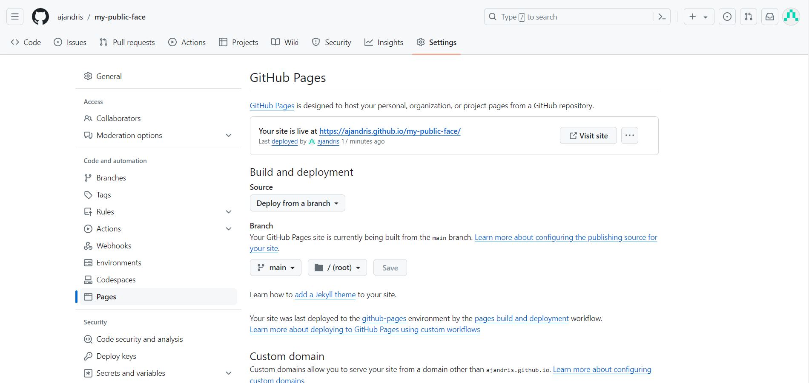

# Andris Jancevskis space
## Introduction
This is a part of me for the public. It can be seen on GitHub pages https://ajandris.github.io/my-public-face/.

## Site's description
The site is designed to encourage visitors to explore my knowledge and skills and contact me when necessary.

All pages, except the landing page for desktop users, have a uniform responsive design. Pages have a brown background with close-to-white letters. The title and motto are in the top centre, while my photo is in the left corner. The menu is underneath the image and the title.

The main content’s background of each page is a little darker and transparent, so the pages' backgrounds are still visible.

### Features

**The footer** has links to my social media profiles on LinkedIn and GitHub.

**The landing page** for desktop users is a gateway to a world of my knowledge and skills. My photo, a focal point, is encircled by skill groups that resemble planets. Each skill group is further adorned with its specific skills, akin to satellites. Hovering the mouse over a skill group not only reveals a link to the skills page’s header but also extends a warm invitation to explore more, encouraging you to delve deeper into my expertise.

**The skills page** uses colourful bars to express my estimated skills percentage. Click on the image to see the screenshot of the page.

**The experience page** embeds training and education into my work history to show what I learned while working. Click on the image to see the screenshot of the page.

**The contact page** does not have a message sending  functionality, as implementing it would be a Stage 2 task. However, the feedback page is shown when trying to send a message.

### Used Technologies
The site is designed using:
* HTML
* CSS
* W3.CSS stylesheet framework
* Font Awesome icons

Some other utilities were used:
* VS Code as Integrated Development Environment.
* GitHub to store code and version control.
* Grammarly to catch grammar slips and improve the text.
* Fooocus (https://github.com/lllyasviel/Fooocus) to generate the background image.
* Balsamiq Wireframes.

## Development
This part is dedicated to the page's development.

### The Development process
The Development of this site includes consequently following the stages described in detail in the next sections:
1. Requirements gathering described in Strategy Plane – gathering all requirements to the Site. User Stories belong to this stage.
2. Scope definition described in Scope Plane – defining what will be included in the first release.
3. At the start of the design comes the Structure plane, where wireframes are used to design sketches of the pages.
4. The result of a Skeleton plane is the Site’s navigation.
5. The last in Development comes the Surface plane, where all design is completed for various screen sizes and audiences.
6. Then comes the Site testing, which is performed manually using Jigsaw (CSS) and W3 Validator (HTML). Google’s Lighthouse test is used to test the site’s performance.

### ToDo
> Expand and change ToDo as development progresses.
> The current Stage is: Development of Stage 1.

- [x] Create README.md structure

#### Fill the details
- [x] Strategy plane
- [x] Scope plane
- [x] Structure plane
- [X] Skeleton Plane
- [X] Surface Plane

- [X] Adjust Readme to user Stories (detailed Stage 1 description using user stories)
- [X] Desribe technologies used

#### Coding
- [X] Landing page desktop version
- [X] Landing page mobile devices
- [X] Header and Footer for Desktops
- [X] Header and Footer for other devices
- [X] Contents for Desktops
- [X] Contents for other devices

- [X] replace copyright with social icons in footer

##### Pages
- [X] Landing page
- [X] Skills page
- [X] Experience (CV web version)
- [X] Contact
- [X] Contact Thank You page

#### Testing
- [X] Testing
- [X] Validator test screenshots for each page
- [X] Evidence of user stories being fulfilled

#### Other
- [X] Acknowlegements
- [X] Site's Description
- [X] Real skills on landing page.
- [X] Prepare CV
- [X] Table of contents. It is built-in into GitHub inteface.
- [X] Text of not sending on contact's page
- [X] Deployment description

### Strategy plane
#### User Stories
##### As a First-Time visitor
1. As a First-Time visitor, I want to understand what this site is about and what I can learn from it.
2. As a First-Time Visitor, I want to find all the information quickly.

##### As a Recruiter
1. As a recruiter, I want to download the CV.
2. As a recruiter, I want to be able to access the contact information I need with ease and efficiency.
3. As a recruiter, I want to explore more about a person in social networks.
4. As a recruiter, I want to know a person's projects.

##### As a Site Owner
1. As a site owner, I want to create a professional web presence that includes my skills and experience.
2. As a site owner, I want to be easily contactable by recruiters.

#### User requirements
The purpose of the space is to market myself and get hired. The following requirements reflect this purpose.
* Used technologies should reflect my skills in UI design and development.
* It contains the list of skills and experience I have acquired. The accent should be on IT skills with complementary business skills.
* The first page (landing page) should be eye-catching and encourage a visitor to explore further.
* The site contains links to my Facebook, GitHub and LinkedIn profiles.
* There is an opportunity to download the whole CV.
* It must have a Contact page.
* Pass Code Institute assessment.

Optional:
* SEO features.
#### Code Institute requirements
Main Technologies
Required: HTML, CSS
Optional: Bootstrap and/or other CSS libraries/frameworks.
Mandatory Requirements
A project violating any of these requirements will FAIL.
1.	Static front-end project: Write custom HTML5 and CSS3 code to create a website of at least 3 pages or (if using a single scrolling page) at least 3 separate page areas.
2.	Information Architecture: Incorporate a main navigation menu and structured layout (you might want to use Bootstrap to accomplish this).
3.	Documentation: Write a README.md file for your project that explains what the project does and the value that it provides to its users.
4.	Version Control: Use Git & GitHub for version control.
5.	Attribution: Maintain clear separation between code written by you and code from external sources (e.g. libraries or tutorials). Attribute any code from external sources to its source via comments above the code and (for larger dependencies) in the README.
6.	Deployment: Deploy the final version of your code to a hosting platform such as GitHub Pages.
#### Audience
The intended audience of the site is potential recruiters and contractors.

### Scope plane
In this initial stage, the design will be created. It will not be publishable for a broader audience in a permanent place.
#### Functional scope
1.	Use HTML5, CSS5 and Bootstrap v5.0.2 (optional).
2.	Static pages only.
3.	A uniform for all page’s mobile version design.
4.	Screen reader’s friendly design.
5.	Use GitHub to save work during development.

#### Stage 1 Content scope
* Landing page with a Wow! design for desktop computers and tablets.
* The contact form with a Thank you page after the message is sent.
* Skills page.
* Work History
* CV download functionality.
#### Out of Stage 1 scope
Here is the listed functionality that is to be implemented to make pages publishable.
* Actual sending email from the contact form. This requires server-side programming.
* ReCAPTCHA in the contact form.
* The content and CV fine-tuning.
* SEO features.
* With server-side interactivity enabled, reorganise the site by moving the header and footer out of each page into separate files and include the header and footer from these files. That will make enabling changes in all site pages easier by changing only one file.
### Structure plane
The structure plane is concerned with design elements – what will be on pages. Wireframes allow seeing what will be on pages. There is no detailed design or colours (in most cases); schematic elements only are placed on a page.

**Landing Page for Desktop computers**

**Landing Page for Mobile devices**

**Skills page**

**Experience page**

**Contact form**

**Contact form feedback**

**Pages for Mobile devices**

### Skeleton Plane

The web page will load seamlessly and pass the Chrome Lighthouse test.

Transitions between screens are not managed, as the next page will load seamlessly having only one image.

The content of pages will be consistent and accurate by meaning.

Users with assisted technologies such as screen readers can access all content.

### Surface Plane
All pages are designed to adapt seamlessly to various screen sizes. Whether it's a desktop, tablet, or mobile screen, the user experience remains consistent and optimal.

All pages (except the desktop landing page) are uniform, with the same header and footer, and use the same font and colour patterns.

Due to the small project size, there is no design mock-up, and all elements will be built during development using the try-and-fix method.

***Colour pattern***

Background hex codes which are present on the desktop size's background image:
* Brown: #34281d
* Darker brown: #1e2a30
* Even darker: #121114

The main content box background colour with opacity: rgba(30, 42, 48, 0.75)

Font colours: #fafafa.

# Testing
## Manual tests
The main testing was done during development process.

Checking if the site works in general, whether it works as intended on different browsers.
* Links are working
* Are pages responsive
* Does it respond on mouse hover over links

|Browser    | Links    | Responsiveness | Hovering over links | Overall result |
|:----------|:--------:|:--------------:|:-------------------:|:--------------:|
|Chrome     | working  |  responsive    |  work as intended   |   pass         |
|Firefix    | working  |  responsive    |  work as intended   |   pass         |
|Edge       | working  |  responsive    |  work as intended   |   pass         |
|Opera      | working  |  responsive    |  work as intended   |   pass         |
|Safari *   | working  |  responsive    |  work as intended   |   pass         |

*) Safari for Windows has been discontinued since 2010 with version 5.1.7. I downloaded version 5.1.5. 
* There was an issue with the ellipsis around social links - it was 100% wide instead of just around social links on the desktop landing page. I checked with the Mac user's Safari (v7.x) version, and it works as intended.
* The same issue was with image transform on desktop landing page. It works on latest Safari versions on Mac.

## CSS
Tests with Jigsaw CSS validator (https://jigsaw.w3.org/css-validator/).

|Page                              |     Result      |          Link      |
|:---------------------------------|:---------------:|:------------------:|
|index.html                        |       Ok        | <a href="assets/readme/css-validator/index-result.jpg" target="_blank">Link to index result</a> |
|experience.html                   |       Ok        | <a href="assets/readme/css-validator/experience-result.jpg" target="_blank">Link to experience result</a> |
|contact-me.html                   |       Ok        | <a href="assets/readme/css-validator/contact-me-result.jpg" target="_blank">Link to contact-me result</a> |
|skills.html                       |       Ok        | <a href="assets/readme/css-validator/skills-result.jpg" target="_blank">Link to skills result</a> |

### Fixed bugs
1. Errors were in main.css wish is used for all pages:
    * *.exp-legend* has no measurement for width
    * *.contact-form* input has no measurement for border
    * Corrected and re-checked main.css file only, no errors found.
2. There are font-awesome errors which I am not in control of.

## HTML
Tests with HTML validator (https://validator.w3.org/).

|Page                              |     Result      |       Comment      |    Link      |
|:---------------------------------|:---------------:|:-------------------|:------------:|
|index.html                        |       Ok        | Errors link  <a href="assets/readme/html-validator/index-errors.jpg" target="_blank">Link to errors screenshot</a> | <a href="assets/readme/html-validator/index-result.jpg" target="_blank">Link to index result</a> |
|experience.html                   |       Ok        |Errors link  <a href="assets/readme/html-validator/experience-errors.jpg" target="_blank">Link to errors screenshot</a> | <a href="assets/readme/html-validator/experience-result.jpg" target="_blank">Link to experience result</a> |
|contact-me.html                   |       Ok        |Errors link  <a href="assets/readme/html-validator/contact-me-errors.jpg" target="_blank">Link to errors screenshot</a> Added id attribute to textarea | <a href="assets/readme/html-validator/contact-me-result.jpg" target="_blank">Link to contact-me result</a> |
|skills.html                       |       Ok        |                    | <a href="assets/readme/html-validator/skills-result.jpg" target="_blank">Link to skills result</a> |
|thank-you.html                    |       Ok        |                    | <a href="assets/readme/html-validator/thank-you-result.jpg" target="_blank">Link to thank-you page's result</a> |

### Fixed bugs
1. All designs were made using a non-working Google Fonts link, which gave an error. Google font was used only on the index page. Google Fonts were removed completely as redundant.
2. Replaced ' ' tag with ' ' as validator suggested.
3. The validation warning about the absence of a section header is not targeted, as the section tag holds a specific semantic meaning in the project and represents a block between the heading and footer, providing a clear structure to my design.

* There were unclosed div tag on all pages. Fixed it and re-checked. 

## Loading speed
Chrome Developer Tools Lighthouse testing.
|Page                              |     Result      |  Link Mobile   |  Link Desktop  |
|:---------------------------------|:---------------:|:--------------:|:--------------:|
|index.html                        |       Ok        | <a href="assets/readme/lighthouse/index-mobile-result.jpg" target="_blank">Link to index mobile result</a> | <a href="assets/readme/lighthouse/index-desktop-result.jpg" target="_blank">Link to index desktop result</a> |
|experience.html                   |       Ok        | <a href="assets/readme/lighthouse/experience-mobile-result.jpg" target="_blank">Link to experience mobile result</a> | <a href="assets/readme/lighthouse/experience-desktop-result.jpg" target="_blank">Link to experience desktop result</a>  |
|contact-me.html                   |       Ok        | <a href="assets/readme/lighthouse/contact-me-mobile-result.jpg" target="_blank">Link to contact-me mobile result</a> | <a href="assets/readme/lighthouse/contact-me-desktop-result.jpg" target="_blank">Link to contact-me desktop result</a> |
|skills.html                       |       Ok        | <a href="assets/readme/lighthouse/skills-mobile-result.jpg" target="_blank">Link to skills mobile result</a> | <a href="assets/readme/lighthouse/skills-desktop-result.jpg" target="_blank">Link to skills desktop result</a> |

**NB!** performance results depend on device's performance, especially for mobile devices. I had much less than 90% performance (rendering took 40% of loading time) before I closed all unnecessary browser tabs and windows.

## Acceptance criteria
### Fulfilment of user stories

|ID| User story | Evidence description |
|--|:-----------|:---------------------|
|US-1|As a First-Time visitor, I want to understand what this site is about and what I can learn from it.|Each page has a menu that links to all the other pages. The desktop landing page has hint text to help users start exploring the site. <a href="assets/readme/acceptance/user-stories/us-1-desktop.jpg">Link to the desktop screenshot</a> <a href="assets/readme/acceptance/user-stories/us-1-mobile.jpg">Link to the mobile screenshot</a>|
|US-2|As a First-Time Visitor, I want to find all the information quickly.|Each page has a menu with links to all other pages. <a href="assets/readme/acceptance/user-stories/us-2-desktop.jpg">Link to the desktop screenshot</a> <a href="assets/readme/acceptance/user-stories/us-2-mobile.jpg">Link to the mobile screenshot</a>|
|US-3| As a recruiter, I want to download the CV.|Each page has a menu item "Download CV," and the experience page has an additional link in the text. <a href="assets/readme/acceptance/user-stories/us-3-desktop.jpg">Link to the desktop screenshot</a> <a href="assets/readme/acceptance/user-stories/us-3-mobile.jpg">Link to the mobile screenshot</a>|
|US-4|As a recruiter, I want to be able to access the contact information I need with ease and efficiency.|Each page has a menu item, "Contact", which leads to a contact form. <a href="assets/readme/acceptance/user-stories/us-4-desktop.jpg">Link to the desktop screenshot</a> <a href="assets/readme/acceptance/user-stories/us-4-mobile.jpg">Link to the mobile screenshot</a>|
|US-5|As a recruiter, I want to explore more about a person in social networks.|For convenience, there are LinkedIn and GitHub icons with links in the footer of each page. <a href="assets/readme/acceptance/user-stories/us-5-desktop.jpg">Link to the desktop screenshot</a> <a href="assets/readme/acceptance/user-stories/us-5-mobile.jpg">Link to the mobile screenshot</a>|
|US-6|As a recruiter, I want to know a person's projects.|There is a GitHub icon with a link in the footer of each page. <a href="assets/readme/acceptance/user-stories/us-6-desktop.jpg">Link to the desktop screenshot</a> <a href="assets/readme/acceptance/user-stories/us-6-mobile.jpg">Link to the mobile screenshot</a>|
|US-7|As a site owner, I want to create a professional web presence that includes my skills and experience.|The website has skills and experience pages, and links in menu to downloadable CV in PDF format. <a href="assets/readme/acceptance/user-stories/us-7-desktop.jpg">Link to the desktop screenshot</a> <a href="assets/readme/acceptance/user-stories/us-7-mobile.jpg">Link to the mobile screenshot</a>|
|US-8|As a site owner, I want to be easily contactable by recruiters.|Each page has a menu item, "Contact", which leads to a contact form. <a href="assets/readme/acceptance/user-stories/us-8-desktop.jpg">Link to the desktop screenshot</a> <a href="assets/readme/acceptance/user-stories/us-8-mobile.jpg">Link to the mobile screenshot</a>|

### Stage 1 scope criteria fulfilment

|ID| Requirement | Evidence description |
|--|:------------|:---------------------|
|RQ-1|Landing page with a Wow! design for desktop computers and tablets.|The desktop landing page's design is more artistic and different from the rest of the site. <a href="assets/readme/acceptance/requirements/rq-1.jpg">Link to the Landing Page screenshot</a>|
|RQ-2|The Contact form with a Thank you page after the message is sent.|Each page has a menu item, "Contact", which leads to a contact form. When the form is submitted, the user is forwarded to the Thank you page. <a href="assets/readme/acceptance/requirements/rq-2-1.jpg">Link to the Contact Form's screenshot</a> <a href="assets/readme/acceptance/requirements/rq-2-2.jpg">Link to the Thank You Page's screenshot</a>|
|RQ-3|Skills page.|Each page has a menu item, "Skills", which leads to a skills page. <a href="assets/readme/acceptance/requirements/rq-3-desktop.jpg">Link to the desktop Skills Page's screenshot</a> <a href="assets/readme/acceptance/requirements/rq-3-mobile.jpg">Link to the mobile Skill Page's screenshot</a>|
|RQ-4|Work History.|Each page has a menu item, "Experience", which leads to a experience page. <a href="assets/readme/acceptance/requirements/rq-4-desktop.jpg">Link to the desktop Experience Page's screenshot</a> <a href="assets/readme/acceptance/requirements/rq-4-mobile.jpg">Link to the mobile Experience Page's screenshot</a>|
|RQ-5|CV download functionality.|Each page has a menu item "Download CV," and the Experience page has an additional link in the text. <a href="assets/readme/acceptance/requirements/rq-5-desktop.jpg">Link to the desktop screenshot</a> <a href="assets/readme/acceptance/requirements/rq-5-mobile.jpg">Link to the mobile screenshot</a>||

## Deployment
The site is deployed on GitHub Pages.

To deploy a project on GitHub Pages:
1. Navigate to your project
2. Select *Settings* on the top menu
3. Select *Pages* on the left side menu
4. On the main page content:
    1. Select *Deploy from Branch*
    2. Select Branch. Usually, for small project it is *main* and directory */(root)*
    3. Press *Save* button

Be patient, as the pages might take approximately a minute to populate. When they are ready, links in a box will appear at the top of the main content.

When updating code, it might take seconds for changes to appear on the GitHub pages.

## Attribution
Original images are cropped to fit banner size.

**Experience page** banner

Saved from
https://haneco.com.au/wp-content/uploads/2020/05/warehouse_top-banner-1024x367.jpg

**Skills page** banner

Photo by Pixabay: https://www.pexels.com/photo/php-screengrab-270348/

## Acknowledgements

I sincerely thank my tutor, Rachel Furlong, for her patient guidance and unwavering patience in online sessions. Her expertise and encouragement have been instrumental in my coding journey.

I am deeply grateful to my mentors, Martina Terlevic and Mitko Bachvarov, for their unwavering support and insightful critiques throughout my coding journey. Their guidance has been invaluable.

## References
Code fragments (commented in main.css):
'.footer' class: https://www.w3schools.com/howto/howto_css_fixed_footer.asp
'tooltip' classes: https://www.w3schools.com/css/css_tooltip.asp

## Bibliography
Sources in this section were used for multiple small requests and a greater understanding of CSS and the W3.css framework.

*W3Schools*, https://www.w3schools.com/. Last accessed 04/06/2024
